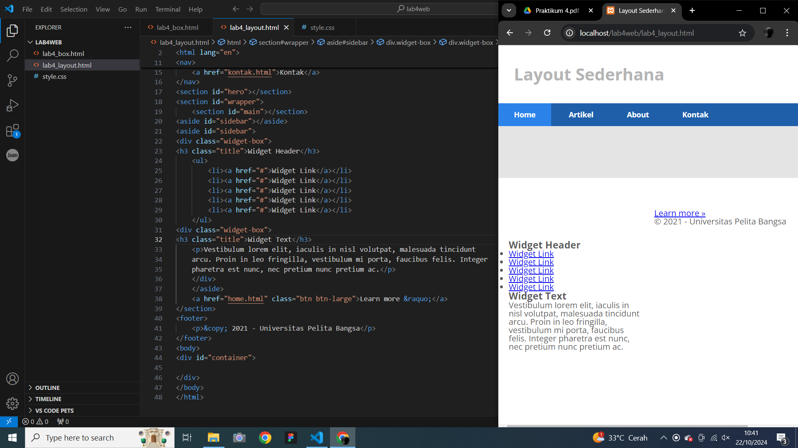
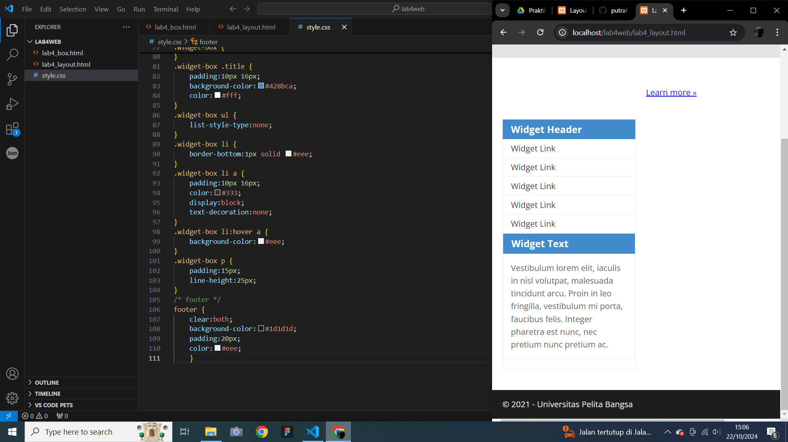

# Lab4web
## Nama  : Muhamad Ananda Putra Fraceda
## NIM   : 312310440
## Kelas : TI.23.A4
## 1. Persiapan membuat dokumen HTML.
- Gambar1
  
# 2. Kemudian tambahkan kode untuk membuat Box Element
- Gambar1
  
# 3.Selanjutnya tambahkan deklarasi CSS pada head untuk membuat float element
- Gambar1
  
- Gambar2
  
# 4. Kemudian Tambahkan element div lainnya seteleah div3
- Gambar1
  
# 5. Kemudian atur property clear pada CSS
- Gambar1
  
# 6. Buat folder baru dengan nama lab4_layout
- Gambar1
  
# 7. Kemudian buat kerangka layout dengan semantics element
- Gambar1
  
- Gambar2
  
# 8. Kemudian tambahkan kode CSS untuk membuat layoutnya
- Gambar1
  
- Gambar2
  
# 9. Kemudian selanjutnya mengatur navigasi.
- Gambar1
  
- Gambar2
  
# 10. Selanjutnya membuat hero panel. Tambahkan kode HTML dan CSS
- Gambar1
  
- Gambar2
  
# 11. Selanjutnya mengatur main content dan sidebar
- Gambar1
  
- Gambar2
  
# 12. Kemudian selanjutnya menambahkan element lain dalam sidebar
- Gambar1
  
- Gambar2
  
# 13. Kemudian tambahkan CSS
- Gambar1
  
- Gambar2
  
# 14. Selanjutnya mengatur tampilan footer
- Gambar1
  
- Gambar2
  
# 15. Menambahkan Elemen lainnya pada Main Content
- Gambar1
  
- Gambar2
  
# 16. Kemudian tambahkan CSS
- Gambar1
  
- Gambar2
  
# 17. Selanjutnya membuat content artikel
- Gambar1
  
- Gambar2
  
# 18. Kemudian tambahkan CSS
- Gambar1
  
- Gambar2
  

